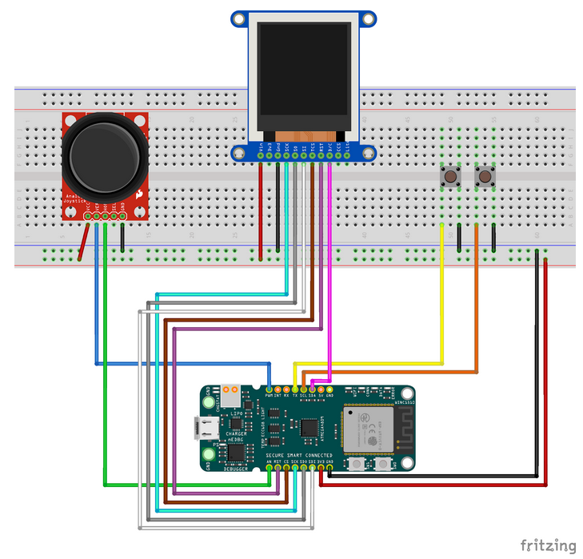

# Celeste Classic on an ATmega3208

Small "weekend project" recreating about half of [Celeste Classic](https://www.lexaloffle.com/bbs/?tid=2145) on an ATmega3208 microcontroller and also adding Bluetooth multiplayer.

## Hardware

Two identical boards, each consisting of:

 - 1x [AVR-BLE development board](https://www.microchip.com/en-us/development-tool/dt100111)
    - Don't exactly love these things but they were readily available
 - 1x [Adafruit 1.44" Color TFT LCD Display with MicroSD Card breakout - ST7735R](https://www.adafruit.com/product/2088)
    - Same resolution as PICO-8
 - 1x [SparkFun Thumb Joystick Breakout](https://www.sparkfun.com/products/9110)
    - They were cheap
 - 2x generic push buttons

## Software

I used:

 - [MPLAB X IDE](https://www.microchip.com/en-us/tools-resources/develop/mplab-x-ide) v6.20
 - [XC8](https://www.microchip.com/en-us/tools-resources/develop/mplab-xc-compilers) v2.50

Open Celeste.X in MPLAB. Inside bluetooth.c are some hardcoded MAC addresses you may want to change.
