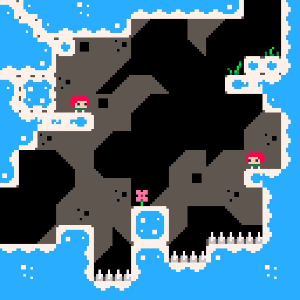

# Celeste on an ATmega3208

Recreation of about half of Maddy Thorson and Noel Berry's [Celeste for PICO-8](https://www.lexaloffle.com/bbs/?tid=2145) on an ATmega3208 microcontroller. Also added Bluetooth multiplayer.

## Hardware

Two identical boards, each consisting of:

 - 1x [AVR-BLE development board](https://www.microchip.com/en-us/development-tool/dt100111)
    - Don't exactly love these things but they were readily available
 - 1x [Adafruit 1.44" Color TFT LCD Display with MicroSD Card breakout - ST7735R](https://www.adafruit.com/product/2088)
    - Same resolution as PICO-8
 - 1x [SparkFun Thumb Joystick Breakout](https://www.sparkfun.com/products/9110)
    - They were cheap
 - 2x generic push buttons

## Software

I used:

 - [MPLAB X IDE](https://www.microchip.com/en-us/tools-resources/develop/mplab-x-ide) v6.20
 - [XC8](https://www.microchip.com/en-us/tools-resources/develop/mplab-xc-compilers) v2.50

Open Celeste.X in MPLAB. Inside bluetooth.c are some hardcoded MAC addresses you may want to change.

Use build configuration "Madeline" to upload the code to the board which will be the host, and the "Theo" configuration to the board which will be the client.

## License

The code portions are under the [GNU General Public License v3.0](LICENSE). Most sprites and levels portions are copied from the original Celeste which doesn't have a license specified. I also copied some glyphs from https://fontstruct.com/fontstructions/show/2205487/8x8-pixel-3.
